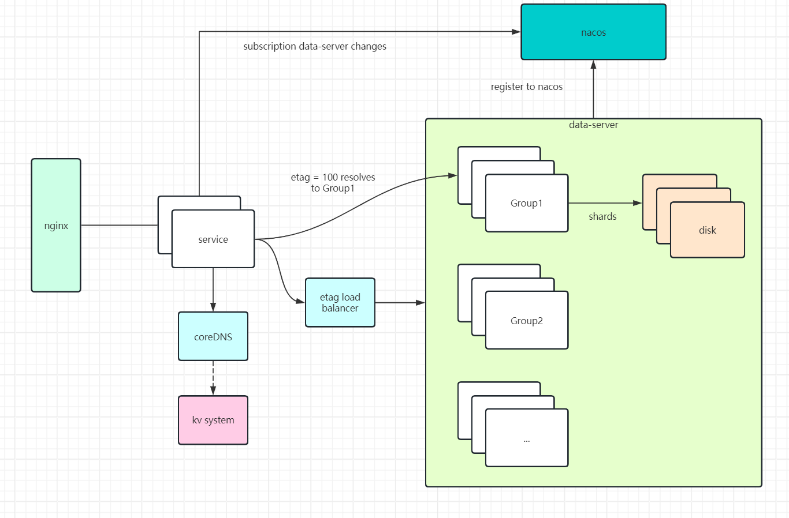

# Cloud Can

# 前言

注：该项目荣获第十四届服创大赛中部赛区三等奖。

本项目将会持续迭代/优化。

# 项目介绍


cloud-can 是一个分布式对象存储系统(object storage system)。


# 什么是对象存储

对象存储是一种用于存储和检索大量非结构化数据的数据存储模式。与传统的文件系统存储不同，对象存储不以文件层次结构进行组织，而是将数据存储为对象，每个对象都包含数据、元数据和一个唯一的标识符。对象存储通常用于存储大型文件和多媒体内容，例如图片、音频、视频、备份和归档数据。

存储桶（Bucket）： 存储桶是对象存储系统中用于组织和管理对象的容器。存储桶可以看作是文件系统中的文件夹，用于对对象进行逻辑分组和管理。存储桶具有**唯一**的名称，每个用户可以创建至多1000个存储桶，一个或多个对象可以存储在同一个存储桶中。

对象（Object）： 对象是存储在对象存储系统中的基本单位。每个对象都由数据本身和与之关联的元数据组成。

对象的基本访问方式：curl -X GET http://{endpoint}/{bucketName}/{objectName}

其他：扩展性、可靠性、持久性、访问权限控制、RESTful API访问

# 功能篇

 参考Amazon S3的ACL和存储桶策略,cloud can基于JWT+SpringMVC拦截器实现了自己的业务层用户权限管理。

**用户**

用户（User）：是由云服务提供商创建的一个实体，代表一个具体的个人或者实体（比如应用程序）。用户可以登录并且拥有自己的安全凭证（比如用户名和密码、访问密钥等），可以被授予特定的权限以便执行特定的操作。

子用户（Subuser）：在某些云服务提供商的 IAM 中，可以创建子用户来代表用户所拥有的资源或权限的一部分。子用户通常由父用户（主用户）创建，并且可以被授予一定的权限。子用户不拥有独立的安全凭证，而是通过父用户的凭证来访问资源。


**BucketACL (存储桶访问控制列表)**

BucketACL（Bucket Access Control List）是用来管理存储桶（Bucket）级别的权限控制的。它决定了谁可以对存储桶执行特定操作，例如读取存储桶内的对象、向存储桶写入对象、删除存储桶内的对象等。

包括以下几种权限：

PUBLIC_READ_WRITE（公共读写）：任何人都可以进行读写操作。

RAM_READ_WRITE（RAM读写）：对于存储桶只有用户和子用户可以进行读写操作，通常用于向公司内提供桶内资源的读和写。

PUBLIC_READ（公共读）：对于存储桶用户可以进行写操作，任何人都可以进行读操作，通常用于向公司外提供桶内免费的资源的读。

RAM_READ（RAM读）：对于存储桶拥有者与其子用户可以进行写操作，任何人都可以进行读操作，通常用于向公司内提供免费的资源的写。

PRIVATE（私有）：对于存储桶只有拥有者可以进行读写操作，其他人无法访问，通常用于公司绝密文件，不提供给任何人。

**ObjectACL (对象访问控制列表)**

ObjectACL（Object Access Control List）是用来管理对象（Object）级别的权限控制的。它决定了谁可以对存储桶中的特定对象执行特定操作，例如读取对象、写入对象、删除对象等。

权限策略除了有BucketACL的几种之外，提供了DEFAULT（继承）策略（当对象被PUT时权限将从ObjectACL存储桶中继承并随之改变）。

**BucketPolicy（存储桶策略）**

可以为**特定用户**对于某个**存储桶**设置权限，其中包括：

ONLY_READ（只读，不包含ListObject操作）：用户只能进行读取操作，不包括列举存储桶内对象的操作。

ONLY_READ_INCLUDE_LIST（只读，包含ListObject操作）：用户只能进行读取操作，包括列举存储桶内对象的操作。

READ_AND_WRITER（读/写）：用户可以进行读取和写入操作，包括列举存储桶内对象的操作。

FULL_CONTROL（完全控制）：用户拥有对存储桶内所有操作的完全控制权限。

ACCESS_DENIED（拒绝访问）：用户被拒绝对存储桶内的任何操作的访问。

**AccessKey（访问控制凭证）**

类似于某度网盘的分享文件功能，拥有key的用户可以在过期时间之内访问对象而无需经过ACL校验。

**对象元数据**

clou can基于MYSQL存储对象元数据，支持基本的RESTful API进行访问。

**对象数据**

对象以 bucketName/objectName 进行扁平化存储。支持：

文件校验：计算文件hash比对校验，确保上传前和下载以后对象数据的一致性。

小文件上传： 指将文件直接上传到目标服务器的操作。用于上传小于**5MB**的文件。

大文件上传： 指上传大小较大的文件到目标服务器的操作。最高支持**100G**的文件上传。

文件分片上传： 指将大文件分割成小的片段（分片），然后分别上传这些分片到目标服务器或存储系统。这样做的目的是提高上传速度和可靠性，并且在网络传输中出现故障时可以重传某些分片而不是整个文件。

文件追加： 指向现有文件添加新数据的操作，而不是覆盖或替换整个文件。通常用于日志文件、记录文件等需要不断追加数据的场景。

文件断电续传： 指在网络传输中断时，能够恢复传输并继续传输未完成的部分。这种机制确保了文件传输的可靠性和完整性。

并行上传： 同时使用多个上传通道或线程来并行上传文件的不同部分，以提高上传速度。这种方法可以充分利用网络带宽和服务器资源，加快文件上传的速度。

文件HTTP流式传输下载： 指通过HTTP协议进行文件下载，并且支持在下载过程中逐段获取文件内容，而不是等待整个文件下载完成才能开始处理。

文件FTP流式传输下载： 指通过FTP（文件传输协议）进行文件下载，并且支持在下载过程中逐段获取文件内容，而不是等待整个文件下载完成才能开始处理。

文件断点传输下载： 文件断点传输下载是指支持在网络传输中断后能够恢复传输并继续下载未完成的文件。通过记录下载进度或使用特定协议来实现。

# 实现原理

## 技术路线

### Cloud Can 1.0 （单机对象存储，重业务）

Cloud Can v1.0采用单节点存储，考虑到对象存储是许多企业和组织存储重要数据和业务关键数据的重要基础设施，
单机存储存在明显的性能低、可用性差、可靠性低、扩展性有限以及存储容量有限等缺点，
企业的要求在这样的架构下显然是不能够保证。

### Cloud Can 2.0（重构存储模块，重存储开发）

#### 一致性

1.从用户体验来看，最终一致性方案会导致用户在PUT对象以后短暂时间内依然访问到是旧数据，无疑这对于对象存储的用户来说是不希望看到的。

2.从性能影响来看，针对强一致性目前已有许多开源高性能的解决方案，强一致性的性能问题也并非不可解决。

cloud can 所有读写操作都严格遵守read-after-write一致性模型。

PS ：Amazon S3一开始选择最终一致性方案，但在2020年12月08日更改为了强一致性方案。

https://aws.amazon.com/cn/blogs/china/amazon-s3-update-strong-read-after-write-consistency/

#### 为什么是Raft

对于强⼀致性共识算法，当前工业生产中，最多使用的就是 Raft 协议，
Raft 协议更容易让人理解，并且有很多成熟的工业算法实现，比如

1. 蚂蚁金服的 JRaft

2. Zookeeper 的 ZAB

3. Consul 的 Raft

4. 百度的 braft

5. Apache Ratis

因为 Cloud Can 是 Java 技术栈，因此只能在 JRaft、ZAB、ApacheRatis 中选择，
但是 ZAB 因为和 Zookeeper 强绑定， 再加上希望可以和 Raft 算法库的支持团队沟通交流，
因此选择了 JRaft，选择 JRaft 也是因为 JRaft 支持多 RaftGroup，为 Cloud Can 水平扩展容量提供了可能。


#### 如何保证可靠性

考虑到节点可能会硬件故障、数据腐败或其他意外事件导致数据丢失的问题，
采用RS纠删码将对象进行分片，shards保存在多个磁盘上。

Reed-Solomon（RS）码是存储系统较为常用的一种纠删码，它有两个参数k和m，
记为RS (k，m)。 k个数据块组成一个向量D被乘上一个生成矩阵B从而得到一个数据向量，
该向量由k个数据块和m个校验块构成。
如果一个数据块丢失，可以通过一系列计算来恢复出丢失的数据块。
RS (k，m)最多可容忍m个块（包括数据块和校验块）丢失。


#### 服务注册

Nacos提供了服务组订阅功能和节点元信息修改等功能，
针对节点上线和下线等问题提供了解决方案。
此外，Nacos支持集群部署并且在企业生产环境得到了广泛应用，
非常适合作为对象存储的注册中心。


#### 元数据管理

MinIO对于元数据存储在本地，不使用元数据节点。而Cloud Can有一部分的业务不是纯基架。 
考虑到一些复杂的元数据查询业务需要编写SQL来实现，需要NoSQL、MYSQL、Redis、SQLite、Hbase等作为元数据节点。
最后作为Java后端开发，对MYSQL、Redis等技术栈比较熟悉，自然是最合适的选择了。

#### RESTful API

使用SpringBoot + Mybatis进行业务开发。

## 技术选型

<div align="left">
  
  
  
  
  
  
</div>

| 技术         | 说明       | 官网                                      |
|------------|----------|-----------------------------------------|
| nacos      | 服务注册与发现  | https://github.com/alibaba/nacos        |
| springboot | HTTP通信   | https://spring.io/projects/spring-boot  |
| Sofa-JRaft | RAFT算法实现 | https://github.com/sofastack/sofa-jraft |
| Sofa-Blot  | 内部服务通信   | https://github.com/sofastack/sofa-bolt  |
| redis      | 内存数据库    | https://github.com/redis/redis          |
| mysql      | 元数据存储    | https://github.com/mysql                |


## Cloud Can基本概念

Etag：对象**二进制数据**的的唯一标识。可用于对象校验和去重。

Group：在逻辑上的存储基本单位，扩容时需要增加Group数量。
把 Group 可以比喻成一个仓库，一个新对象的保存就类似于把一个包裹放到仓库里面。  
一个Etag只会存在于唯一的Group当中。

在底层实现上，Group是一个RaftGroup。


CoreDNS：用于解析Etag存在于哪个Group中。

Loadbalancer：负载均衡器，根据Etag计算存储位置（Group）。

Redis：用于记录Etag->Group->Count的映射。(采用hash结构实现)

Nginx：Service层的负载均衡。

Service：业务处理层，可配合Nginx集群部署。

整体架构图如下：



## 数据定位问题

在分布式存储系统中，数据的位置存放规则一直是研究的热门话题之一。
Loadbalancer需要有一个统一的数据寻址算法Locator，满足：
Locator(Etag) -> [Group_1, Group_2, Group_2, ...]

直观方案是维护一张全局的Key-Value表，任何操作数据时查询该表即可。

显然，随着数据量的增多和集群规模的扩大，要在整个系统中维护这么一张不断扩大的表变得越来越困难。
假如整个系统的瓶颈在元数据存储，就需要一种其他的实现方式。

**如果选择不维护kv表，应该如何实现**

目前业界的解决方案：

1. 在每个Group中维护一张本地记录表，遍历每个Group查询Etag是否存在
2. 使用一致性Hash算法，相较于普通取余Hash（MinIO的解决方案），如果出现了新的Group，每次涉及到一个区间Etag的迁移。

3. 使用Crush算法（ceph的解决方案）
```
def Locator(Etag):
    for index, item in Groups:
    draw = crush_hash(item.id, Etag, trial) 
    draw *= item.weight
    if index == 0 or draw > high_draw:
    high_item = item
    high_draw = draw
    return high_item
```

crush_hash中trial为常量，只要参数不变返回值也不会改变。

如果出现了新的Group，每个Etag是否需要迁移的决定因素是old_group_wight < new_group_wight

当然也有其他的主流的负载均衡算法，这些算法新增Group通常需要迁移大量的Etag。比较常见的就是hash取余法。

**Cloud Can 的方案**

数据迁移往往会带来许多问题，同时也会增加系统设计的复杂度。

经过压测和分析，由于数据加密、数据分片等操作性能瓶颈主要出现在CPU，而不是Location数据存储。

同时kv数据库redis能够提供非常高效的数据存储是不错的选择。

Cloud Can最终采用Redis存储Location值。

但这并不意味着就不需要考虑负载均衡问题。

在Cloud Can中可以根据需求配置不同的负载均衡算法。

1. 轮询
3. 随机
4. Hash取余
5. 一致性Hash
6. Crush算法


### 如何选择？

首先Group内机器配置均匀可以选择：轮询、随机、一致性哈希、Hash取余

不均匀可以选择：加权轮询、Crush算法

权值的设定具体需要看Group机器配置（CPU、磁盘的吞吐、IOPS以及容量）。


## Read-After-Writer

强一致性有许多实现方案，最终采用的是SOFAJraft的解决方案。

### Raft Log read

实现线性一致读最常规的办法是走 Raft 协议，将读请求同样按照 Log 处理，通过 Log 复制和状态机执行来获取读结果，
然后再把读取的结果返回给 Client。因为 Raft 本来就是一个为了实现分布式环境下线性一致性的算法，
所以通过 Raft 非常方便的实现线性 Read，也就是将任何的读请求走一次 Raft Log，
等此 Log 提交之后在 apply 的时候从状态机里面读取值，一定能够保证这个读取到的值是满足线性要求的。

### ReadIndex Read

当 Leader 需要处理 Read 请求时，Leader 与过半机器交换心跳信息确定自己仍然是 Leader 后可提供线性一致读。
不同于通过 Raft Log 的 Read，ReadIndex Read 使用 Heartbeat 方式来让 Leader 确认自己是 Leader，省去 Raft Log 流程。

### Lease Read

Raft 论文里面提及一种通过 Clock + Heartbeat 的 Lease Read 优化方法，
也就是 Leader 发送 Heartbeat 的时候首先记录一个时间点 Start，当系统大部分节点都回复 Heartbeat Response，
由于 Raft 的选举机制，Follower 会在 Election Timeout 的时间之后才重新发生选举，
下一个 Leader 选举出来的时间保证大于 Start+Election Timeout/Clock Drift Bound，
所以可以认为 Leader 的 Lease 有效期可以到 Start+Election Timeout/Clock Drift Bound 时间点。
Lease Read 与 ReadIndex 类似但更进一步优化， 不仅节省 Log，而且省掉网络交互，大幅提升读的吞吐量并且能够显著降低延时。

### SOFAJraft的解决方案

SOFAJRaft 采用 ReadIndex 替代走 Raft 状态机的方案，简而言之是依靠 ReadIndex 原则直接从 Leader 读取结果：
所有已经复制到多数派上的 Log（可视为写操作）被视为安全的 Log，Leader 状态机只要按照顺序执行到此条 Log之后，
该 Log 所体现的数据就能对客户端 Client 可见。


## 项目模块


cloud-can -- 源码目录

├── oss-common -- 公共模块

├── oss-disk -- 磁盘持久化模块

├── oss-encryption -- 加密模块

├── oss-hash -- hash模块

├── oss-loadbalance -- 负载均衡模块

├── oss-node -- 数据存储服务

├── oss-nodeclient -- 数据存储服务客户端

├── oss-reedsolomon -- RS纠删码模块

├── oss-rpc -- RPC通信模块

├── oss-sdk -- 提供Java SDK访问等

├── oss-service -- 业务服务


## How to start


| 前置环境             |
|------------------|
| jdk 1.8          |
| mysql 8          |
| nacos 2.0.4      |
| redis 任意版本       |
| SOFAJRaft 1.3.13 |


#### 说明:


兼容WIndows和Linux

