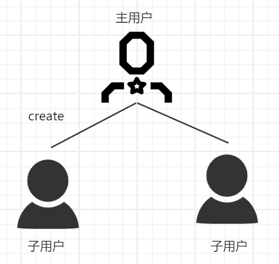

# 功能篇
参考Amazon S3的ACL和存储桶策略,cloud can基于JWT+SpringMVC拦截器实现了自己的业务层用户权限管理。

**用户**

主用户（User）：是由云服务提供商创建的一个实体，代表一个具体的个人或者实体（比如应用程序）。用户可以登录并且拥有自己的安全凭证（比如用户名和密码、访问密钥等），可以被授予特定的权限以便执行特定的操作。

子用户（Subuser）：在某些云服务提供商的 IAM 中，可以创建子用户来代表用户所拥有的资源或权限的一部分。子用户通常由父用户（主用户）创建，并且可以被授予一定的权限。子用户不拥有独立的安全凭证，而是通过父用户的凭证来访问资源。

**BucketACL (存储桶访问控制列表)**

BucketACL（Bucket Access Control List）是用来管理存储桶（Bucket）级别的权限控制的。它决定了谁可以对存储桶执行特定操作，例如读取存储桶内的对象、向存储桶写入对象、删除存储桶内的对象等。

包括以下几种权限：

PUBLIC_READ_WRITE（公共读写）：任何人都可以进行读写操作。

RAM_READ_WRITE（RAM读写）：对于存储桶只有用户和子用户可以进行读写操作，通常用于向公司内提供桶内资源的读和写。

PUBLIC_READ（公共读）：对于存储桶用户可以进行写操作，任何人都可以进行读操作，通常用于向公司外提供桶内免费的资源的读。

RAM_READ（RAM读）：对于存储桶拥有者与其子用户可以进行写操作，任何人都可以进行读操作，通常用于向公司内提供免费的资源的写。

PRIVATE（私有）：对于存储桶只有拥有者可以进行读写操作，其他人无法访问，通常用于公司绝密文件，不提供给任何人。

**ObjectACL (对象访问控制列表)**

ObjectACL（Object Access Control List）是用来管理对象（Object）级别的权限控制的。它决定了谁可以对存储桶中的特定对象执行特定操作，例如读取对象、写入对象、删除对象等。

权限策略除了有BucketACL的几种之外，提供了DEFAULT（继承）策略（当对象被PUT时权限将从ObjectACL存储桶中继承并随之改变）。

**BucketPolicy（存储桶策略）**

可以为**特定用户**对于某个**存储桶**设置权限，其中包括：

ONLY_READ（只读，不包含ListObject操作）：用户只能进行读取操作，不包括列举存储桶内对象的操作。

ONLY_READ_INCLUDE_LIST（只读，包含ListObject操作）：用户只能进行读取操作，包括列举存储桶内对象的操作。

READ_AND_WRITER（读/写）：用户可以进行读取和写入操作，包括列举存储桶内对象的操作。

FULL_CONTROL（完全控制）：用户拥有对存储桶内所有操作的完全控制权限。

ACCESS_DENIED（拒绝访问）：用户被拒绝对存储桶内的任何操作的访问。

**AccessKey（访问控制凭证）**

类似于某度网盘的分享文件功能，拥有key的用户可以在过期时间之内访问对象而无需经过ACL校验。

**对象元数据**

clou can基于MYSQL存储对象元数据，支持基本的RESTful API进行访问。

**对象数据**

对象以 bucketName/objectName 进行扁平化存储。支持：

文件校验：计算文件hash比对校验，确保上传前和下载以后对象数据的一致性。

小文件上传： 指将文件直接上传到目标服务器的操作。用于上传小于**5MB**的文件。

大文件上传： 指上传大小较大的文件到目标服务器的操作。最高支持**100G**的文件上传。

文件分片上传： 指将大文件分割成小的片段（分片），然后分别上传这些分片到目标服务器或存储系统。这样做的目的是提高上传速度和可靠性，并且在网络传输中出现故障时可以重传某些分片而不是整个文件。

文件追加： 指向现有文件添加新数据的操作，而不是覆盖或替换整个文件。通常用于日志文件、记录文件等需要不断追加数据的场景。

文件断电续传： 指在网络传输中断时，能够恢复传输并继续传输未完成的部分。这种机制确保了文件传输的可靠性和完整性。

并行上传： 同时使用多个上传通道或线程来并行上传文件的不同部分，以提高上传速度。这种方法可以充分利用网络带宽和服务器资源，加快文件上传的速度。

文件HTTP流式传输下载： 指通过HTTP协议进行文件下载，并且支持在下载过程中逐段获取文件内容，而不是等待整个文件下载完成才能开始处理。

文件FTP流式传输下载： 指通过FTP（文件传输协议）进行文件下载，并且支持在下载过程中逐段获取文件内容，而不是等待整个文件下载完成才能开始处理。

文件断点传输下载： 文件断点传输下载是指支持在网络传输中断后能够恢复传输并继续下载未完成的文件。通过记录下载进度或使用特定协议来实现。