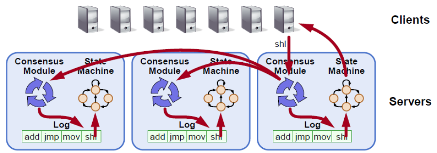
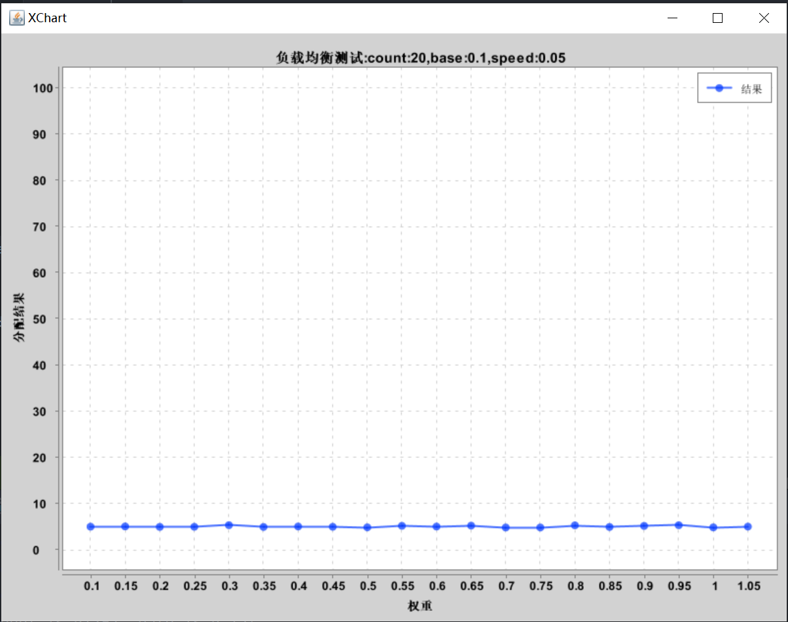

# 技术路线与原理

## 技术路线

### Cloud Can 1.0 （单机对象存储，重业务）

Cloud Can v1.0采用单节点存储，考虑到对象存储是许多企业和组织存储重要数据和业务关键数据的重要基础设施，
单机存储存在明显的性能低、可用性差、可靠性低、扩展性有限以及存储容量有限等缺点，
企业的要求在这样的架构下显然是不能够保证。

### Cloud Can 2.0（重构存储模块，重存储开发）

#### 一致性

1.从用户体验来看，最终一致性方案会导致用户在PUT对象以后短暂时间内依然访问到是旧数据，无疑这对于对象存储的用户来说是不希望看到的。

2.从性能影响来看，针对强一致性目前已有许多开源高性能的解决方案，强一致性的性能问题也并非不可解决。

cloud can 所有读写操作都严格遵守read-after-write一致性模型。

PS ：Amazon S3一开始选择最终一致性方案，但在2020年12月08日更改为了强一致性方案。

https://aws.amazon.com/cn/blogs/china/amazon-s3-update-strong-read-after-write-consistency/

#### 为什么是Raft

对于强⼀致性共识算法，当前工业生产中，最多使用的就是 Raft 协议，
Raft 协议更容易让人理解，并且有很多成熟的工业算法实现，比如

1. 蚂蚁金服的 JRaft

2. Zookeeper 的 ZAB

3. Consul 的 Raft

4. 百度的 braft

5. Apache Ratis

因为 Cloud Can 是 Java 技术栈，因此只能在 JRaft、ZAB、ApacheRatis 中选择，
但是 ZAB 因为和 Zookeeper 强绑定， 再加上希望可以和 Raft 算法库的支持团队沟通交流，
因此选择了 JRaft，选择 JRaft 也是因为 JRaft 支持多 RaftGroup，为 Cloud Can 水平扩展容量提供了可能。


#### 如何保证可靠性

考虑到节点可能会硬件故障、数据腐败或其他意外事件导致数据丢失的问题，
采用RS纠删码将对象进行分片，shards保存在多个磁盘上。

Reed-Solomon（RS）码是存储系统较为常用的一种纠删码，它有两个参数k和m，
记为RS (k，m)。 k个数据块组成一个向量D被乘上一个生成矩阵B从而得到一个数据向量，
该向量由k个数据块和m个校验块构成。
如果一个数据块丢失，可以通过一系列计算来恢复出丢失的数据块。
RS (k，m)最多可容忍m个块（包括数据块和校验块）丢失。


#### 服务注册

Nacos提供了服务组订阅功能和节点元信息修改等功能，
针对节点上线和下线等问题提供了解决方案。
此外，Nacos支持集群部署并且在企业生产环境得到了广泛应用，
非常适合作为对象存储的注册中心。


#### 元数据管理

MinIO对于元数据存储在本地，不使用元数据节点。而Cloud Can有一部分的业务不是纯基架。
考虑到一些复杂的元数据查询业务需要编写SQL来实现，需要NoSQL、MYSQL、Redis、SQLite、Hbase等作为元数据节点。
最后作为Java后端开发，对MYSQL、Redis等技术栈比较熟悉，自然是最合适的选择了。

#### RESTful API

使用SpringBoot + Mybatis进行业务开发。

## 技术选型

<div align="left">
  
  
  
  
  
  
</div>

| 技术         | 说明        | 官网                                      |
|------------|-----------|-----------------------------------------|
| nacos      | 服务注册与发现   | https://github.com/alibaba/nacos        |
| springboot | HTTP通信    | https://spring.io/projects/spring-boot  |
| Sofa-JRaft | RAFT算法实现  | https://github.com/sofastack/sofa-jraft |
| Sofa-Blot  | 内部服务RPC通信 | https://github.com/sofastack/sofa-bolt  |
| redis      | 内存数据库     | https://github.com/redis/redis          |
| mysql      | 元数据存储     | https://github.com/mysql                |


## Cloud Can基本概念

Etag：对象**二进制数据**的的唯一标识。可用于对象校验和去重。

Group：在逻辑上的存储基本单位，扩容时需要增加Group数量。
把 Group 可以比喻成一个仓库，一个新对象的保存就类似于把一个包裹放到仓库里面。  
一个Etag只会存在于唯一的Group当中。

在底层实现上，Group是一个RaftGroup。



NodeClient：用于解析Etag存在于哪个Group中。

Loadbalancer：负载均衡器，根据Etag计算存储位置（Group）。

Redis：用于记录部分kv业务数据。

Nginx：Service层的负载均衡。

Service：业务处理层，可配合Nginx集群部署。

整体架构图如下：


## 数据定位问题

在分布式存储系统中，数据的位置存放规则一直是研究的热门话题之一。
Loadbalancer需要有一个统一的数据寻址算法Locator，满足：
Locator(Etag) -> [Group_1, Group_2, Group_2, ...]

直观方案是维护一张全局的Key-Value表，任何操作数据时查询该表即可。

显然，随着数据量的增多和集群规模的扩大，要在整个系统中维护这么一张不断扩大的表变得越来越困难。
假如整个系统的瓶颈在元数据存储，就需要一种其他的实现方式。

**如果选择不维护kv表，应该如何实现**

目前业界的解决方案：

1. 在每个Group中维护一张本地记录表，遍历每个Group查询Etag是否存在
2. 使用一致性Hash算法，相较于普通取余Hash（MinIO的解决方案），如果出现了新的Group，每次涉及到一个区间Etag的迁移。
   
3. 使用Crush算法（ceph的解决方案）
```
def Locator(Etag):
    for index, item in Groups:
    draw = crush_hash(item.id, Etag, trial) 
    draw *= item.weight
    if index == 0 or draw > high_draw:
    high_item = item
    high_draw = draw
    return high_item
```

crush_hash中trial为常量，只要参数不变返回值也不会改变。

如果出现了新的Group，每个Etag是否需要迁移的决定因素是old_group_wight < new_group_wight

当然也有其他的主流的负载均衡算法，这些算法新增Group通常需要迁移大量的Etag。比较常见的就是hash取余法。

**Cloud Can 的负载均衡**

对上述问题进行说明以后我们知道负载均衡算法的选取需要有一个前提：每次选取Group时应该只与Etag有关。

在保证前提下，应该如何选取合适的负载均衡算法？

显然随机算法和轮询算法已经不能做考虑了，经过筛选以下算法成为了较好的选择。

测试数据量：100W

1. 一致性Hash（VIRTUAL_NODE_SIZE=1000）

分配与权重无关
2. Crush算法（BASE=10,TRIAL=1）

分配会受到权重的影响


   
### 如何选择？

首先Group内机器配置均匀可以选择：轮询、随机、一致性哈希、Hash取余

不均匀可以选择：加权轮询、Crush算法

权值的设定具体需要看Group机器配置（CPU、磁盘的吞吐、IOPS以及容量）。

简单点来说：

多个RaftGroup配置一致时选择一致性Hash。

存在较大的性能差异时使用Crush算法来分配权重。

## Read-After-Writer

强一致性有许多实现方案，最终采用的是SOFAJraft的解决方案。

### Raft Log read

实现线性一致读最常规的办法是走 Raft 协议，将读请求同样按照 Log 处理，通过 Log 复制和状态机执行来获取读结果，
然后再把读取的结果返回给 Client。因为 Raft 本来就是一个为了实现分布式环境下线性一致性的算法，
所以通过 Raft 非常方便的实现线性 Read，也就是将任何的读请求走一次 Raft Log，
等此 Log 提交之后在 apply 的时候从状态机里面读取值，一定能够保证这个读取到的值是满足线性要求的。

### ReadIndex Read

当 Leader 需要处理 Read 请求时，Leader 与过半机器交换心跳信息确定自己仍然是 Leader 后可提供线性一致读。
不同于通过 Raft Log 的 Read，ReadIndex Read 使用 Heartbeat 方式来让 Leader 确认自己是 Leader，省去 Raft Log 流程。

### Lease Read

Raft 论文里面提及一种通过 Clock + Heartbeat 的 Lease Read 优化方法，
也就是 Leader 发送 Heartbeat 的时候首先记录一个时间点 Start，当系统大部分节点都回复 Heartbeat Response，
由于 Raft 的选举机制，Follower 会在 Election Timeout 的时间之后才重新发生选举，
下一个 Leader 选举出来的时间保证大于 Start+Election Timeout/Clock Drift Bound，
所以可以认为 Leader 的 Lease 有效期可以到 Start+Election Timeout/Clock Drift Bound 时间点。
Lease Read 与 ReadIndex 类似但更进一步优化， 不仅节省 Log，而且省掉网络交互，大幅提升读的吞吐量并且能够显著降低延时。

### CloudCan && SOFAJraft的解决方案

开启Lease Read实现线性一致读
```
// 线性一致读 Lease Read
RaftOptions raftOptions = new RaftOptions();
raftOptions.setReadOnlyOptions(ReadOnlyOption.ReadOnlyLeaseBased);

 public void readOnlySafe(JRaftRpcReq req, DataClosure closure) {
     this.dataServer.getNode().readIndex(BytesUtil.EMPTY_BYTES, new ReadIndexClosure() {
         @Override
         public void run(Status status, long index, byte[] reqCtx) {
             if (status.isOk()) {
                 Object res;
                 try {
                     res = ServiceHandler.invoke(req);
                 }catch (Exception e) {
                     throw new RuntimeException(e);
                 }
                 closure.success(res);
                 closure.run(Status.OK());
             } else {
                 // 特定情况下，比如发生选举，该读请求将失败
                 closure.failure(status.getErrorMsg());
             }
         }
     });
 }
```